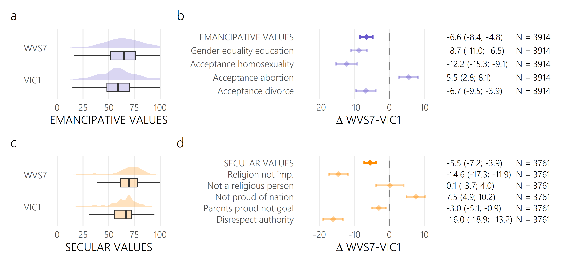

# japanvalues

In this repository, you can find all code and data to reproduce the statistical results presented in the article:

*title*

### Data description

In the subfolder `/data`, you can find four different files:

- `japan_lev1.rds`:

- `jp_census_2020_age_sex_pref.csv`:

- `surveydata.csv`:

- `values_wvs_longitudinal.csv`: 

The most important data set is in `surveydata.csv`. The table contains respondent-level results from Japan's VIC surveys and WVS7 survey. These responses are the basis for our analysis presented in the paper. The other data sets are of auxiliary nature (e.g., population data for post-stratification or prefecture boundaries for plotting maps).

Data dictionary for `surveydata.csv`:

| Column name               | Explanation                                         
|-----------------------------|-----------------------------------------------------------
subject_id | Unique subject ID, including identifier of survey (WVS for World Values Survey; VIC for Values in Crisis survey)
wave | Survey wave (WVS7, VIC1 or VIC2)
participation | All survey waves the respondent participated in (W0 refers to WVS7, W1 to VIC1 and W2 to VIC2)
EVI | Emancipative Values Index (based on six items)
EVI_reduced | short version of the Emancipative Values Index (based on four items)
equal_polit | Item: Gender equality politics (scaled between 0 and 100)
equal_job | Item: Gender equality jobs (scaled between 0 and 100)
equal_educ | Item: Gender equality education (scaled between 0 and 100)
homosexuality | Item: Acceptance homosexuality (scaled between 0 and 100)
abortion | Item: Acceptance abortion (scaled between 0 and 100)
divorce | Item: Acceptance divorce (scaled between 0 and 100)
SVI | Secular Values Index 
rel_imp | Item: Religion not important (scaled between 0 and 100)
rel_person | Item: Not a religious person (scaled between 0 and 100)
nation_pride | Item: Not proud of nation (scaled between 0 and 100)
parents_proud | Item: Parent proud not goal (scaled between 0 and 100)
respect_author | Item: Disrespect authority (scaled between 0 and 100)
age | Age (in years)
hhsize | Household size
children | Number of children
gender | Gender
maritalst | Marital status
education | Education
rel_service | Item: Religious service attendance
hhincome | Household income
distress | Psychological distress (based on five items)
bfive_extra | Short version of the Big Five Inventory: Extraversion
bfive_agree | Short version of the Big Five Inventory: Agreeableness
bfive_consc | Short version of the Big Five Inventory: Conscientiousness
bfive_neuro | Short version of the Big Five Inventory: Neuroticism
bfive_openn | Short version of the Big Five Inventory: Openness to experience
region | Japanese region
prefecture | Japanese prefecture
townsize | Town size
age_sq | Age (in years) squared
age_group | Age (in years) discretized
cum_infected_in_pref_VIC1 | Cumulative number of COVID-19 infections in prefecture at the time of VIC1
cum_deaths_in_pref_VIC1 | Cumulative number of COVID-19 deaths in prefecture at the time of VIC1
emergency_in_pref_VIC1 | Indicator for emergency status of prefecture at time of VIC1

### Getting the analysis code to run

After cloning the repository, all analyses can be reproduced by running a single the R script. The script `R/run_analysis.R` imports all data sets and produces all results. Make sure the package versions on your machine are consistent with the versions indicated in the scrip. The original analysis was run using R v.4.3.1. All results (`.png` files and `.rds` files) are exported into the folder `/results`.

### Compiling the Appendix

The Appendix of the paper is written in RMarkdown, using the `bookdown` package. If the bibliography file is in place (`utils/references.bib`) and the data and results folders are filled with the required files, you can compile the Appendix by knitting `R/appendix.R`.

